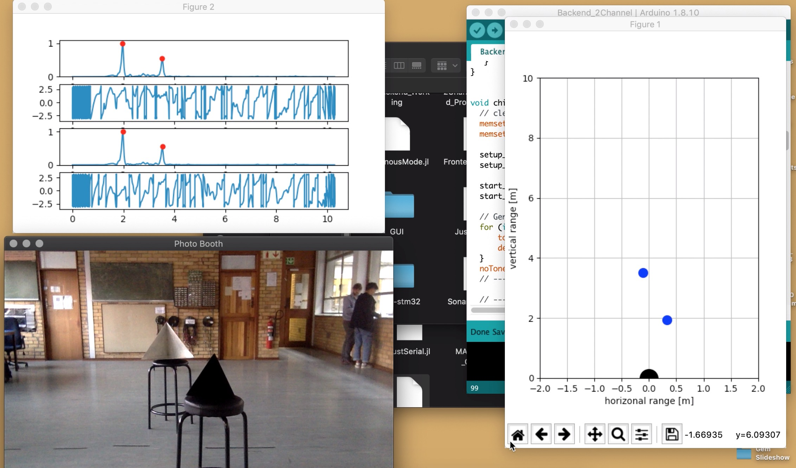

    
    

## 40kHz Ultrasonic SONAR

This project involved the design and development of a small two-dimensional SONAR system, using cheap 40kHz ultrasonic sensors and a [Teensy 3.6](https://www.pjrc.com/store/teensy36.html) development board.

#### Brief Description
This system operated by sending out short chirp sound waves, centered at 40kHz (which is ultrasonic), and then timing the delayed echo signals. Using the received temporal offset and phase difference information, predictions about the scene could be made.

The transmitted wave was generated using a digital signal from the Teensy, which was thereafter amplified by analog circuitry. The incoming, received waves were conditioned, and then sampled by the Teensy's onboard analog-to-digital converters. This data was then sent to the host computer via a Serial connection. There, the data was shifted to baseband, matched filtered, and analysed. By using two receiver channels, range and angle values could be determined in the horizontal plane.

#### Demonstration
A demonstration of this system can be seen in the screenshots and video below.

<iframe width="100%" height="500" src="https://www.youtube-nocookie.com/embed/qydfnggtQR4" frameborder="0" allow="accelerometer; autoplay; encrypted-media; gyroscope; picture-in-picture" allowfullscreen></iframe>

#### Project Report
The full project report can be found [here](../assets/projects/sonar/final_report.pdf).