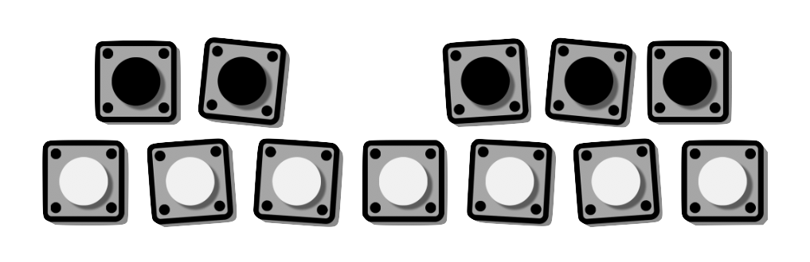

    

## Polyphonic Synthesizer using Direct Digital Synthesis on an FPGA
This project involved prototyping a simple audio synthesizer on a reconfigurable computing platform, a Nexys A7 Artix-7 FPGA. This synthesizer was able to play musical tones through an output audio port with specified frequencies, amplitudes, and waveform types. Moreover, multiple tones were able to play simultaneously—i.e. it was polyphonic.

A detailed analysis into the design and implementation of this project was done, along with a host of performance tests. It was also benchmarked against a 'serial' implementation of a polyphonic audio synthesizer, implemented on a [Teensy 3.6](https://www.pjrc.com/store/teensy36.html) development board.

#### Demonstration
A demonstration of the system is given in the video below.

<iframe width="100%" height="500" src="https://www.youtube-nocookie.com/embed/69vM_XhQ20I" frameborder="0" allow="accelerometer; autoplay; encrypted-media; gyroscope; picture-in-picture" allowfullscreen></iframe>

 

#### Final report
The final report can be read [here](/assets/projects/polyphonic_dds/final_report.pdf). The code is hosted on GitHub, [here](https://github.com/wylieza/revenge_of_the_synth).

#### Further information
Further details about the project can be viewed on the [course webpage](http://ocw.ee.uct.ac.za/courses/EEE4120F/YODA.html). This project achieved [Hall of Fame](http://ocw.ee.uct.ac.za/courses/EEE4120F/HOF.html) status, for the Best Prototype in 2020.